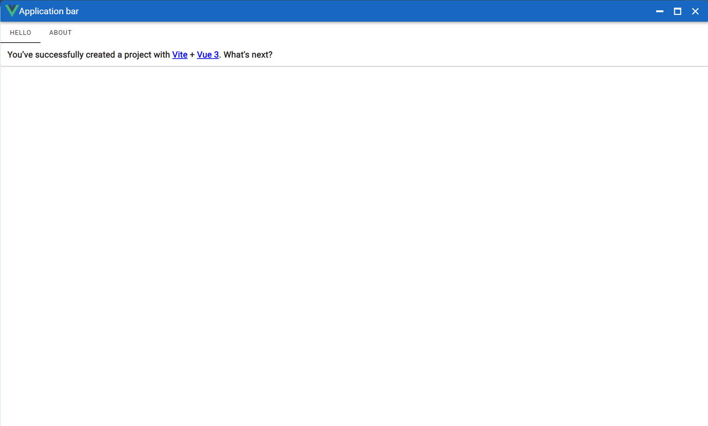

# Template-Electron-Vuetify

这是一个简单的 Electron 项目模板，UI组件采用 Vuetify 框架。

## 页面截图



## 主要依赖

- Electron
- Vue3
- vue-router
- TypeScript
- Pinia
- Vuetify
- Axios
- Vite
- Vitest
- vite-plugin-vue-devtools：默认关闭，可自行开启

## 常用指令

推荐使用 `pnpm` 安装依赖：

```sh
# 安装依赖
pnpm i
```

```sh
# 开发运行
pnpm run dev
```

```sh
# 类型检查并编译
pnpm run build
```

```sh
# 运行electron，开发环境请先运行 pnpm run dev
pnpm run electron-dev
```
