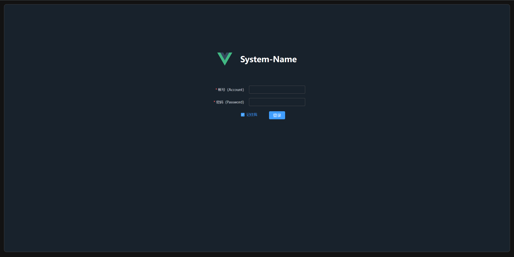

# Template-ElementPlus-Admin

这是一个后台管理系统的前端模板项目，如需开发一个后台管理系统，可以取之即用。

Demo: https://admin.template.oldmoon.top

## 页面截图




## 主要依赖

- Vue3
- TypeScript
- Vue-router
- Pinia
- Element-Plus
- Axios
- Vite
- Vitest
- less
- vite-plugin-vue-devtools：默认关闭，可自行开启

## 基础功能

- 系统架构
- 主页布局
- 登录拦截
- 登录
- 退出登录
- 后端接口开发代理配置
- 路由配置
- 菜单路由

## 常用指令

推荐使用 `pnpm` 安装依赖：

```sh
# 安装依赖
pnpm i
```

```sh
# 开发运行
npm run dev
```

```sh
# 类型检查并编译
npm run build
```

